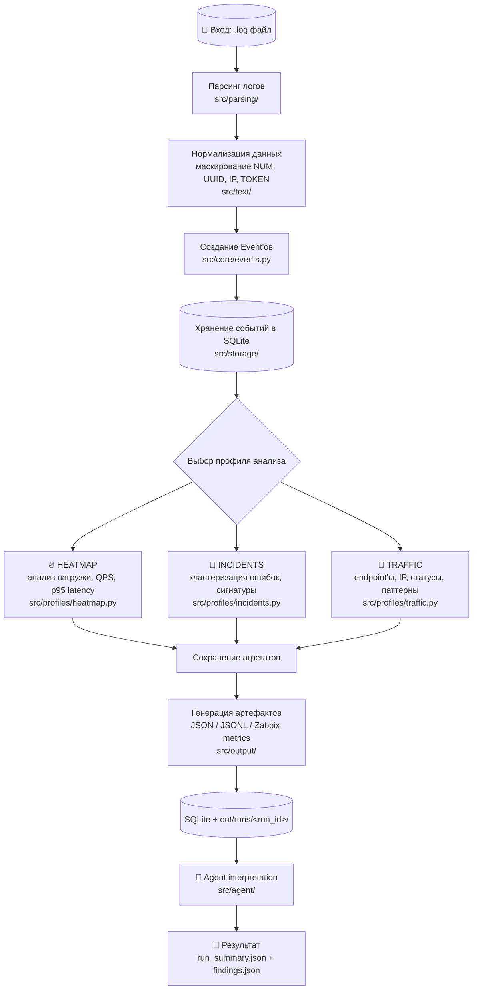
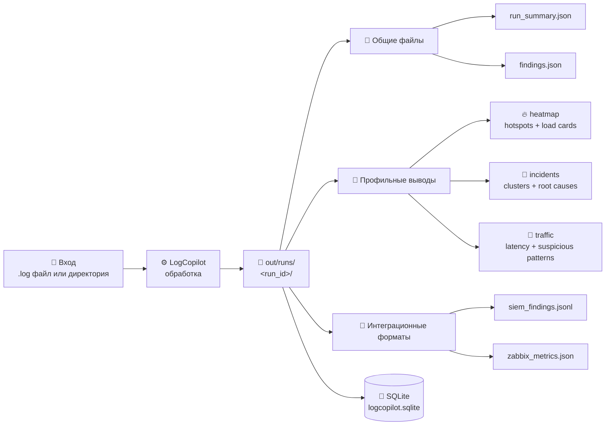

# LogCopilot

`LogCopilot` - инструмент для анализа лог-файлов BPMSoft и инфраструктурных логов. Проект поддерживает три профиля анализа: `heatmap`, `incidents`, `traffic`, сохраняет результаты в SQLite и JSON-артефакты, а также может подключать внешний LLM-этап для интерпретации выводов.

## Основные возможности

- Три режима анализа: `heatmap`, `incidents`, `traffic`.
- Автоматический выбор парсеров для web access, syslog, JSON, logfmt, Windows servicing, BPMSoft Request/Error/BusinessProcess/AspNetCore и fallback-текста.
- Нормализация сообщений и маскирование переменных частей: `NUM`, `UUID`, `IP`, `TOKEN`.
- Хранение запусков, событий и агрегатов в `out/logcopilot.sqlite`.
- Генерация итоговых артефактов: `run_summary.json`, `findings.json`, `siem_findings.jsonl`, `zabbix_metrics.json`.
- CLI-запуск локально или в Docker-контейнере.

## Что зафиксировано в MVP

- Один запуск принимает один входной `.log` файл или batch-директорию с `.log` файлами.
- Пользователь выбирает сценарий: `heatmap`, `incidents`, `traffic`; в batch-режиме можно использовать `auto`.
- Каждый запуск получает свой `run_id`.
- Результат сохраняется в:
  - SQLite: `out/logcopilot.sqlite`
  - файлы: `out/runs/<run_id>/...`

## Сценарии

- `heatmap`: нагрузка, пики активности, активные модули, qps, p95 latency.
- `incidents`: ошибки, сигнатуры, кластеры, semantic-группы, incident report.
- `traffic`: endpoint-ы, статусы, IP, latency, подозрительные паттерны.

## Pipeline Flow



## Быстрый старт

Установить зависимости:

```bash
python -m pip install -r requirements.txt
python -m pip install -e .
```

Запустить обработку одного файла:

```bash
logcopilot run --input data/small-sample.log --profile traffic --out out --semantic off
```

Альтернативный запуск как Python-модуль:

```bash
python -m src.cli run --input data/small-sample.log --profile traffic --out out --semantic off
```

Batch-запуск по директории:

```bash
logcopilot batch --input data --profile auto --out out --semantic off
```

Запустить тесты:

```bash
python -m unittest discover -s tests
```

## Docker

Собрать образ:

```bash
docker build -t logcopilot:latest .
```

Запустить анализ одного файла:

```bash
docker run --rm \
  -v "$PWD/data:/app/data:ro" \
  -v "$PWD/out:/app/out" \
  logcopilot:latest \
  run --input /app/data/small-sample.log --profile traffic --out /app/out --semantic off
```

Запустить через Docker Compose:

```bash
docker compose run --rm logcopilot \
  batch --input /app/data --profile auto --out /app/out --semantic off
```

Для LLM-интерпретации можно передать переменные окружения `YC_FOLDER_ID`, `YC_AI_API_KEY`, `YC_MODEL`, `YC_TIMEOUT`.

## Output Contract



## Что появляется на выходе

Общее для любого успешного запуска:

- `run_summary.json` - краткая сводка запуска, профиль, качество парсинга, ключевые метрики и рекомендации.
- `findings.json` - структурированные карточки найденных проблем.
- `siem_findings.jsonl` - события для SIEM-выгрузки.
- `zabbix_metrics.json` - метрики с ключами вида `logcopilot.*`.
- `out/logcopilot.sqlite` - общая SQLite-база запусков, событий и агрегатов.

## Структура репозитория

```text
src/
  agent/      интерпретация результатов и LLM-провайдеры
  analysis/   качество, кластеризация и semantic-анализ
  core/       сборка канонических Event
  domain/     dataclass-модели и контракты
  output/     итоговые JSON/JSONL/Zabbix-артефакты
  parsing/    детектирование формата и парсеры логов
  profiles/   heatmap / incidents / traffic
  storage/    SQLite-хранилище
  text/       нормализация и сигнатуры
logcopilot/
  __init__.py совместимый import path для старых `logcopilot.*` импортов
tests/
data/
```

## Пояснительная записка

Подробное описание цели, архитектуры, алгоритмов, сборки, запуска, Docker-развертывания и ToDo находится в [`EXPLANATORY_NOTE.md`](EXPLANATORY_NOTE.md).
